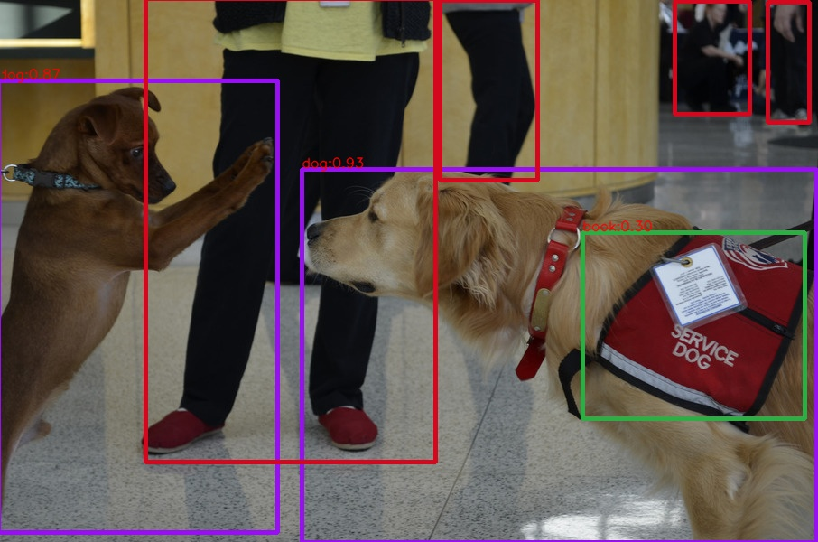
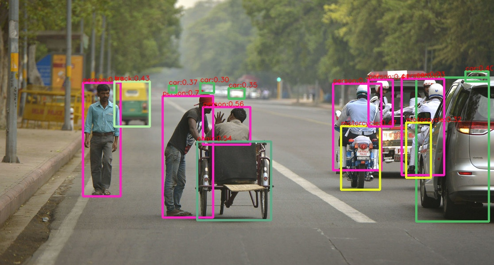

This is a C++ implementation of CenterNet using TensorRT and CUDA. Thanks for the official implementation of [CenterNet](https://github.com/xingyizhou/CenterNet)!





# Dependencies:
- Ubuntu 16.04
- CUDA 10.0 [required]
- TensorRT-7.0.0.11 (for CUDA10.0) [required]
- CUDNN (for CUDA10.0, may not be used) [required]
- libtorch (torch c++ lib of cpu version, gpu version may conflict with the environment) [optional]
- gtest (Google C++ testing framework) [optional]

# Plugins of TensorRT:
- MyUpsampling: F.interpolate/ nn.nn.UpsamplingBilinear2d
- DCN: deformable CNN

# Build & Run:
1. build the  plugins of TensorRT:
bash
```
 cd onnx-tensorrt/plugin/build &&\
 cmake .. &&\
 make -j
```
you may need to explicitly specifiy the path of some libraries. To varify the correctness of plugins, set `Debug` mode and build with `GTEST` in `plugin/CMakeLists.txt`.

2. build the `onnx-tensorrt` with this command:
bash
```
  cd onnx-tensorrt/build &&\
  cmake .. &\
  make -j
```
After successfully building the tool, we can convert the `xxx.onnx` file to serialized TensorRT engine `xxxx.trt`:
bash
```
 cd onnx-tensorrt &&\
 ./build/onnx2trt ctdet-resdcn18.onnx -d 16 -o ~/ctdet-resdcn18-fp16.trt
```

3. build the inference code:
bash
```
  cd centernet-tensorrt/build &&\
  cmake .. &&\
  make -j
```
then, run this command to see the detection's result:
bash
```
 ./build/trt_infer ~/ctdet-resdcn18-fp16.trt ./data/xxxx.jpg
```

